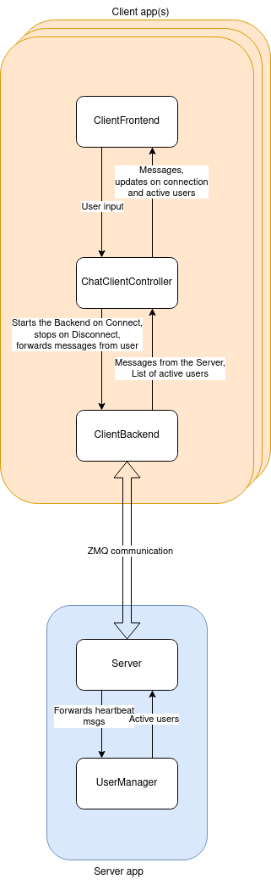

# Chat-Service project
This project contains a simple group chat service.

There is one Server, which is responsible for receiving and distributing the messages, as well as maintaining a list of currently active users.

Furthermore, there can be multiple Clients. Each Client has a simple Qt frontend. Via the frontend, a user can:
- connect to/disconnect from the server,
- send group messages,
- see the received ones,
- see a list of currently active users,
- address messages to specific users only, so that others don't see them.

## Communication
### Server-client
I chose ZMQ for communication framework and Protobuf to serialize the sent data.
ZMQ has a lot of useful features, supports different messaging patterns (e.g. pub/sub), or supports data encryption and authentication, which might be a potential extension idea for this app.

I chose Protobuf because this way, the message structures are clearly defined. Also, Protobuf is faster than e.g JSON because it is a direct binary format.

### Backend-Frontend
In my app, I decided to realize the Backend-Frontend communication via queues, which is an efficient way to exchange data within the same process.

## Simple diagram
The following diagram shows the involved components and their interactions on a very high level.



## How to build and run
### Building
I decided to encapsulate everything into a Docker container, which can be built via docker-compose with the provided `docker-compose.yml` file.
This way, I am sure that the project will build without any dependency issues related to the building environment, because the build envirionment is always the same (a fresh ubuntu 22.04 image).

Before proceeding, you need to have Docker and docker-compose installed - please follow their official [installation manual](https://docs.docker.com/engine/install/ubuntu/).

You will also need to add your user to the docker group and log out and back in (or reboot).
```
sudo usermod -aG docker $USER
```

If you have Docker installed, execute
```
docker-compose build
```
in the project root and the project binaries should be built inside the image.

There are 2 resulting executable binaries: `server` and `client`. They are copied from the build folder to `/usr/bin` to make them easily accessible in the container.

For details about the build process, you can look up the `Dockerfile`.

### Running
After a successful build, you can start the container with `docker-compose up` executed in the repo root.

Verify with `docker ps` that the container is actually running:
```
❯ docker ps
CONTAINER ID   IMAGE             COMMAND                  CREATED        STATUS          PORTS     NAMES
99b2cb527c18   chat_app:latest   "tail -f /dev/null"      2 hours ago    Up 11 minutes             chat_container_1

```

Now you can enter the container by executing `docker exec -it <container_name> /bin/bash`, where the container name in this case would be `chat_container_1`.
You should now be inside the container's shell and see something like
```
❯ docker exec -it chat_container_1 /bin/bash
root@mikolaj-laptop:/home/root#
```

Feel free to open multiple shells in the terminal, to start multiple client applications.
There must be exactly one server application running in order for the entire system to work properly.

#### Starting the Server
Now you can start the server simply by executing the `server` command. You should see some output:
```
root@mikolaj-laptop:/home/root# server
Start waiting for heartbeats...
Start receiving...
```

The default server IP and ports are set and don't need to be adjusted for the example to work (running the server/client with `-h` will display all available options and their default values).

#### Starting the Client(s)
For example, executing the following command should produce a similar output. And you should see the client's Frontend appear.
```
root@mikolaj-laptop:/home/root# client -u test_user_1
QStandardPaths: XDG_RUNTIME_DIR not set, defaulting to '/tmp/runtime-root'
ChatClientApp: HandleIncomingMessages thread started
ChatClientApp: MonitorConnection thread started
ChatClientApp: HandleOutgoingMessages thread started
ChatClientApp: HandleConnectButton thread started
ChatClientApp: HandleActiveUsers thread started
MESA: error: Failed to query drm device.
libGL error: glx: failed to create dri3 screen
libGL error: failed to load driver: iris
libGL error: failed to open /dev/dri/card0: No such file or directory
libGL error: failed to load driver: iris

```
You can ignore those Qt-related errors, the app works in spite of them.

Feel free to start a few clients in a few shell sessions within the container.

Now, press the `Connect` button and you should see that the list of active users gets updated accordingly to the number of connected clients.

Feel free to experiment with sending messages around and disconnecting clients.

In addition, you can select any number of names from the list of active users and then press `Send` - the message will be delivered only to those selected users, omitting the unselected ones.

Also, under [this link](https://drive.google.com/file/d/1NRkTbV-TAqKmMXRNwKcPsrKoO8sZIQOM/view?usp=sharing) you can find an example video presenting the app in operation.
The online quality is pretty bad, but if you download it, the letters will be much more readible.

#### Supported environment
I have tested the execution of the binaries in docker on my laptop running Ubuntu 20.04 (and on a fresh Ubuntu 22.04 VM), but any other Linux distribution, especially Ubuntu, should probably work as well.
I cannot guarantee it to work under Windows without adjustments to the docker-compose file, though.

Since the Client requires access to the display, the docker-compose file shares the required display data with the container.

## Known bugs
The biggest issue that I didn't have enough time to resolve is that the connected clients die when the server stops during operation.

## Other issues/remarks
1. There are magic numbers present in the code (and raw string literals) which ideally should become constexpr and be defined somewhere, but there wasn't enough time for this.
2. There are no tests written.
3. A few inconsitencies - e.g. within one class, 2 queues store shared_ptrs to objects and the third one stores the objects directly. A result of lack of time for proper refactoring/implementation.
4. No logging used - just normal standard output prints. If I had more time, I would have included a proper logging library and allow the user to set the logging level.
5. Some functions receive too many arguments, especially the constructors - if I had more time for refactoring, I would have used the Parameter Objects pattern for that.
6. Ideally, I would have created one CMake project and build the two targets with it, but I wasn't sure how to do it quickly having Qt.


## Troubleshooting
If you see the following error message after starting the client and it crashes:
```
Authorization required, but no authorization protocol specified
qt.qpa.xcb: could not connect to display :0
qt.qpa.plugin: Could not load the Qt platform plugin "xcb" in "" even though it was found.
This application failed to start because no Qt platform plugin could be initialized. Reinstalling the application may fix this problem.
```

you might need to run
```
xhost +local:
```
on your machine's terminal to allow the container to access the display (tested on Ubuntu 20.04 and 22.04).

It doesn't presist through reboots, so you'd need to repeat it every time when you start your computer and want to test the app.
